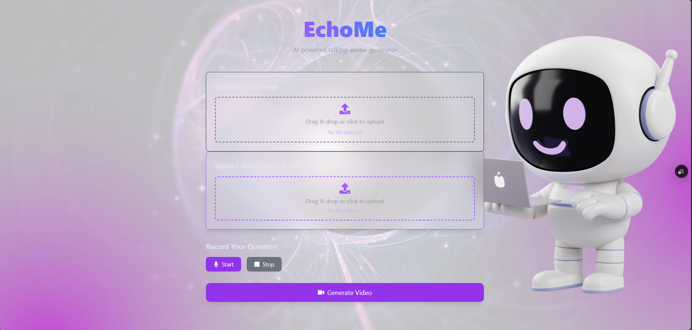

<p align="center">
  
</p>

# EchoMe — Multimodal Conversational Avatar System

EchoMe is a local multimodal AI system that generates a lip-synced talking-avatar video from three user inputs:

* A static face image
* A short voice sample for cloning
* A recorded audio question

The backend uses Whisper for transcription, an LLM for response generation, XTTS for voice synthesis, and Wav2Lip for realistic lip-sync.
The frontend is built using React (Vite + TailwindCSS), while the backend runs on FastAPI.

---

## 1. Features

* Speech-to-text transcription (Whisper Large-v3)
* LLM-based response generation
* Voice cloning and text-to-speech (XTTS v2)
* Lip-synchronized video generation (Wav2Lip)
* Fully local pipeline (no cloud processing required)
* FastAPI backend + modern React frontend
* Privacy-focused — all computation runs locally

### Supported Languages

EchoMe supports:

**English, Spanish, French, German, Italian, Portuguese, Polish, Turkish, Russian, Ukrainian, Arabic, Chinese**

---

## 2. System Architecture

Processing pipeline:

```
Audio Recording → Whisper → LLM → XTTS → Wav2Lip → MP4 Output
```

**Frontend:** React, Vite, TailwindCSS
**Backend:** FastAPI, Python 3.10, PyTorch
**Optional:** CUDA GPU acceleration

---

## 3. Project Structure

```
EchoMe_Project/
│
├── api/
│   ├── main.py                 # FastAPI application
│   ├── pipeline.py             # Full processing pipeline
│   ├── utils.py                # File utilities
│   ├── requirements_echome.txt
│
├── frontend/
│   ├── public/
│   │   └── EchoMe.png          # Project banner image
│   ├── src/
│   │   ├── App.jsx
│   │   ├── main.jsx
│   │   └── components/
│   ├── index.html
│   ├── package.json
│   └── tailwind.config.js
│
├── demo/                       # Downloadable demo videos
├── models/                     # Not included in repo
├── uploads/                    # Temporary uploads
├── outputs/                    # Generated MP4 files
├── environment.yaml            # Conda environment
└── README.md
```

---

## 4. Installation

### Backend

```bash
conda env create -f environment.yaml
conda activate echome
pip install -r api/requirements_echome.txt
uvicorn api.main:app --host 0.0.0.0 --port 8000
```

### Frontend

```bash
cd frontend
npm install
npm run dev
```

---

## 5. Processing Workflow

1. User records an audio question in the frontend.
2. Whisper converts the speech to text.
3. The LLM generates a concise response.
4. XTTS synthesizes the answer using the cloned voice.
5. Wav2Lip generates a synchronized talking-avatar video.
6. The frontend displays the final MP4 output.

---

## 6. Use Cases

* Interactive AI assistants
* Educational and tutoring systems
* Character-based conversational avatars
* Customer support automation
* Accessibility and communication tools
* Creative content and video generation

---

## 7. Demo Videos

Demo videos are available in the **demo/** folder.
(Direct preview may be disabled due to GitHub file-size limits.)

---

## 8. Contributing

Contributions and improvements are welcome.
Please open an issue or submit a pull request.

---

## 9. License

MIT License.
